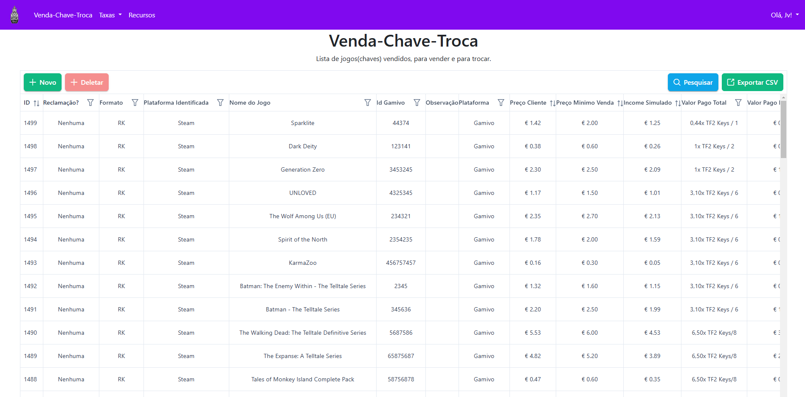

<h1 align="center">Game Key Inventory System</h1>

<p align="center">
  <strong>Inventory management and profit automation for digital game key trading.</strong><br/>
  Built with a pragmatic, pruned Clean Architecture on top of Laravel.
</p>

<p align="center">
  
  
  
  
  
  
  
  
</p>



---

## The problem

Managing a game key trading business across multiple marketplaces (Gamivo, G2A, Kinguin) meant tracking hundreds of keys in spreadsheets — manually calculating purchase costs, net income after marketplace fees, profit margins, and deciding which keys to list. One formula error would silently propagate across the entire inventory.

**The system replaced all of that.** Purchase cost per key is calculated automatically based on the batch's trade value. Profit margins update on every edit. Listing decisions are driven by automated eligibility rules. Sold offers are reconciled via webhook from the Gamivo API.

---

## Impact

**Situation** — A profitable game key trading operation was bottlenecked by manual, error-prone spreadsheet management. Calculating per-key profit required knowing the total batch income, the TF2 key trade price on that day, and the marketplace fee structure — a multi-step formula prone to human error.

**Task** — Build an internal tool that removes spreadsheets entirely, enforces correct financial calculations, and automates the listing and reconciliation workflow.

**Action** — Designed and implemented a full-stack system with a pure PHP domain layer for financial calculations, Laravel for infrastructure, Vue 3 + Inertia for the UI, and integrations with the Gamivo API, GG.deals API, and an internal `price_researcher` service for automated pricing.

**Result:**
- Profit calculation errors dropped to zero — every formula is unit-tested and lives in a framework-independent Domain layer
- Batch key registration went from ~30 minutes of spreadsheet work to a single XLSX upload or JSON submission
- Listing decisions that required manual cross-referencing now execute in milliseconds
- The marketplace fee cache (Redis) eliminated repeated database queries — from 4 queries per request to 1 query per hour

---

## Architecture

### Why not full Clean Architecture?

Clean Architecture prescribes four concentric layers with strict inward dependency rules, every boundary crossed through an interface — repository interfaces, presenter interfaces, input/output port DTOs. The primary promise is **framework independence**: you could swap Laravel for Symfony without touching a single use case.

That promise has a real cost. For a ~10k LOC internal tool with two users and no scaling requirements, it means **20–30 boilerplate files** — interface declarations, adapter implementations, DTOs at every layer crossing — that add indirection without adding value. We will never swap Laravel. There is no second persistence backend to abstract over.

The decision was to **keep the value of Clean Architecture and discard the overhead**:

| What we kept | What we discarded |
|---|---|
| Pure PHP Domain layer — no framework imports | Repository interfaces — we use concrete Eloquent |
| Use Cases as explicit orchestrators | Adapter / Port pattern |
| Services strictly for infrastructure | DTOs at every layer boundary |
| Dependency direction enforced by convention | Dependency injection containers per layer |

### Layer diagram

```
┌─────────────────────────────────────────────────────────────────┐
│  Domain  — pure PHP, zero Laravel dependency                    │
│  Pricing · Keys · Platform · Import · Bundles · Enums           │
└──────────────────────────────┬──────────────────────────────────┘
                               │
┌──────────────────────────────▼──────────────────────────────────┐
│  Use Cases  — one class per business operation                  │
│  RegisterKey · UpdateKey · AutoSell · UpdateSoldOffers          │
│  ImportKeysFromXlsx · SyncBundles · ExecuteVipList              │
└──────────────────────────────┬──────────────────────────────────┘
                               │ calls Services and Domain
┌──────────────────────────────▼──────────────────────────────────┐
│  Services  — infrastructure (Eloquent, Redis cache, HTTP APIs)  │
│  KeyCalculationService · KeyRepository · GameService            │
│  SupplierService · BundleService · CurrencyConversionService    │
└──────────────────────────────┬──────────────────────────────────┘
                               │
┌──────────────────────────────▼──────────────────────────────────┐
│  Controllers  — HTTP only: validate → delegate → respond        │
└─────────────────────────────────────────────────────────────────┘
```

**Controllers** receive HTTP and call a Use Case or Service — nothing else.  
**Use Cases** orchestrate multi-step workflows by coordinating Services and Domain.  
**Services** touch infrastructure: Eloquent queries, Redis cache, external API calls.  
**Domain** receives typed values, applies rules, returns results. No `use Illuminate\` anywhere.

### Domain is independently testable

Because the Domain has zero framework dependencies, every financial calculation and business rule is tested in milliseconds with no database, no HTTP, no service container:

```
tests/Unit/Domain/
├── Pricing/   ProfitCalculator · IncomeCalculator · MinMaxPriceCalculator · SalePriceCalculator
├── Keys/      KeyEligibility · KeyPriceAging
├── Platform/  PlatformIdentifier
├── Import/    ExcelDateConverter · ImportHeaderValidator · ImportRowValidator
└── Bundles/   BundleTypeResolver
```

---

## Tech stack

| Layer | Technology |
|---|---|
| Backend | Laravel 11 · PHP 8.3 |
| Frontend | Vue 3 · TypeScript · Inertia.js |
| Database | PostgreSQL 16 |
| Cache | Redis 7 |
| Testing | Pest 3 |
| Infrastructure | Docker · Docker Compose · Nginx · PHP-FPM |
| External integrations | Gamivo API · GG.deals API · AwesomeAPI (FX rates) |

---

## Getting started

Requires [Docker](https://www.docker.com/) and [Docker Compose](https://docs.docker.com/compose/).

```bash
# 1. Clone the repository
git clone https://github.com/JoaoVitor2310/sistema-estoque-jogos-cd
cd sistema-estoque-jogos-cd

# 2. Configure environment variables
cp .env.example .env
# Fill in DB credentials, Redis, and external API keys

# 3. Start all containers (app, Nginx, PostgreSQL, Redis)
docker compose up -d

# 4. Install dependencies and run migrations
docker compose exec app-cd composer install
docker compose exec app-cd php artisan migrate

# 5. Open the app
open http://localhost:170
```

```bash
# Run the test suite
docker compose exec app-cd php artisan test

# Open a shell inside the container
docker compose exec app-cd bash
```
